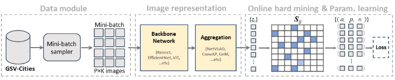
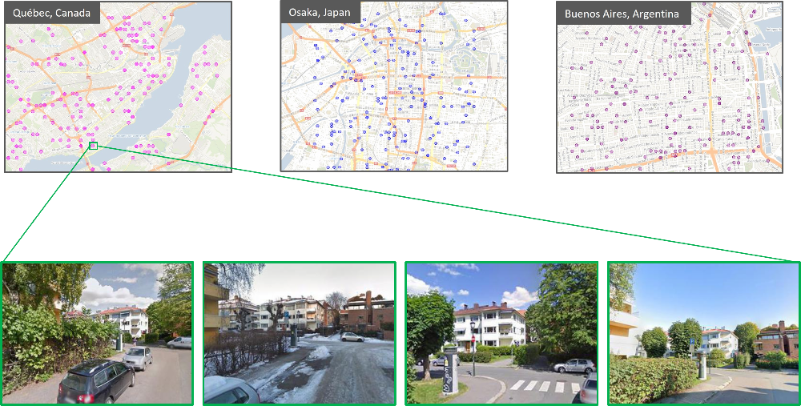

# GSV-Cities

Official repo for *Neurocomputing 2022* paper
**GSV-Cities: Toward Appropriate Supervised Visual Place Recognition**

[[ArXiv](https://arxiv.org/abs/2210.10239)] [[ScienceDirect](https://www.sciencedirect.com/science/article/abs/pii/S0925231222012188)] [[Bibtex](https://github.com/amaralibey/gsv-cities#cite)] [[Dataset]([https://www.kaggle.com/datasets/amaralibey/gsv-cities](https://www.kaggle.com/datasets/amaralibey/gsv-cities))]

* The dataset is hosted on [[Kaggle](https://www.kaggle.com/datasets/amaralibey/gsv-cities)].
* Training can be run from `main.py`, the code is commented and should be clear. Feel free to open an issue if you have any question.
* To evaluate trained models, we included a Jupyter Notebook: https://github.com/amaralibey/gsv-cities/tree/main/notebooks/evaluate_model.ipynb

---

## **Summary of the paper**

1. We collected **GSV-Cities**, a large-scale dataset for the task of Visual Place Recognition, with highly accurate ground truth.
   * It contains ~530k images.
   * There are more than 62k different places, spread across multiple cities around the globe.
   * Each place is depited by at least 4 images (up to 20 images).
   * All places are physically distant (at least 100 meters between any pair of places).
2. We proposed a fully convolutional aggregation technique (called **Conv-AP**) that outperforms NetVLAD and most existing SotA techniques.
3. We consider representation learning for visual place recognition as a three components pipeline as follows:



What can we do with GSV-Cities dataset and the code base in this repo?

* Obtain new state-of-the-art performance.
* Train visual place recognition models *extremely* rapidly.
* No offline triplet mining: GSV-Cities contains highly accurate ground truth. Batches are formed in a traightforward way, bypassing all the hassle of triplet preprocessing.
* Rapid prototyping: no need to wait days for convergence (expect 10-15 minutes of per epoch).
* All existing techniques can benefit from training on GSV-Cities.

## Trained models

Please refer to the following [Jupyter Notebook](https://github.com/amaralibey/gsv-cities/tree/main/notebooks/evaluate_model.ipynb) for evaluation.

<table>
<thead>
  <tr>
    <th rowspan="2">Backbone</th>
    <th rowspan="2">Output<br>dimension</th>
    <th colspan="2">Pitts250k-test</th>
    <th colspan="2">Pitts30k-test</th>
    <th colspan="2">MSLS-val</th>
    <th colspan="2">Nordland</th>
    <th rowspan="2"></th>
  </tr>
  <tr>
    <th>R@1</th>
    <th>R@5</th>
    <th>R@1</th>
    <th>R@5</th>
    <th>R@1</th>
    <th>R@5</th>
    <th>R@1</th>
    <th>R@5</th>
  </tr>
</thead>
<tbody>
  <tr>
    <td>ResNet50</td>
    <td>4096<br>(1024x2x2)</td>
    <td>92.5</td>
    <td>97.7</td>
    <td>90.5</td>
    <td>95.3</td>
    <td>83.5</td>
    <td>89.7</td>
    <td>42.6</td>
    <td>59.8</td>
    <td rowspan="2"><a href="https://drive.google.com/drive/folders/1VYPw9uGD11NgiGFgfWueLt3noJYOIuhL">LINK</a></td>
  </tr>
  <tr>
    <td>ResNet50</td>
    <td>8192<br>(2048x2x2)</td>
    <td>92.8</td>
    <td>97.7</td>
    <td>90.5</td>
    <td>95.2</td>
    <td>83.1</td>
    <td>90.3</td>
    <td>42.7</td>
    <td>58.8</td>
  </tr>
</tbody>
</table>


Code to load the pretrained weights is as follows:

```python
from main import VPRModel

# Note that these models have been trained with images resized to 320x320
# Also, either use BILINEAR or BICUBIC interpolation when resizing.
# The model with 4096-dim output has been trained with images resized with bicubic interpolation
# The model with 8192-dim output with bilinear interpolation
# ConvAP works with all image sizes, but best performance can be achieved when resizing the training resolution

model = VPRModel(backbone_arch='resnet50', 
                 layers_to_crop=[],
                 agg_arch='ConvAP',
                 agg_config={'in_channels': 2048,
                            'out_channels': 1024,
                            's1' : 2,
                            's2' : 2},
                )


state_dict = torch.load('./LOGS/resnet50_ConvAP_1024_2x2.ckpt')
model.load_state_dict(state_dict)
model.eval()

```


---

## GSV-Cities dataset overview

* GSV-Cities contains ~530,000 images representing ~62,000 different places, spread across multiple cities around the globe.
* All places are physically distant (at least 100 meters between any pair of places).



#### **Database organisation**

Unlike existing visual place recognition datasets where images are organised in a way that's not (so humanly) explorable. Images in GSV-Cities are named as follows:

`city_placeID_year_month_bearing_latitude_longitude_panoid.JPG`

This way of naming has the advantage of exploring the dataset using the default Image Viewer of the OS, and also, adding redondancy of the metadata in case the Dataframes get lost or corrupt.

The dataset is organised as follows:

```
├── Images
│   ├── Paris
│   │   ├── ...
│   │   ├── PRS_0000003_2015_05_584_48.79733778544615_2.231461206488333_7P0FnGV3k4Fmtw66b8_-Gg.JPG
│   │   ├── PRS_0000003_2018_05_406_48.79731397404108_2.231417994064803_R2vU9sk2livhkYbhy8SFfA.JPG
│   │   ├── PRS_0000003_2019_07_411_48.79731121699659_2.231424930041198_bu4vOZzw3_iU5QxKiQciJA.JPG
│   │   ├── ...
│   ├── Boston
│   │   ├── ...
│   │   ├── Boston_0006385_2015_06_121_42.37599246498178_-71.06902130162344_2MyXGeslIiua6cMcDQx9Vg.JPG
│   │   ├── Boston_0006385_2018_09_117_42.37602467319898_-71.0689666533628_NWx_VsRKGwOQnvV8Gllyog.JPG
│   │   ├── ...
│   ├── Quebec
│   │   ├── ...
│   ├── ...
└── Dataframes
    ├── Paris.csv
    ├── London.csv
    ├── Quebec.csv
    ├── ...

```

Each datadrame contains the metadata of the its corresponding city. This will help access the dataset almost instantly using Pandas. For example, we show 5 rows from London.csv:

| place_id | year | month | northdeg | city_id |     lat |        lon | panoid                 |
| -------: | ---: | ----: | -------: | :------ | ------: | ---------: | :--------------------- |
|      130 | 2018 |     4 |       15 | London  | 51.4861 | -0.0895151 | 6jFjb3wGyCkcBfq4k559ag |
|     6793 | 2016 |     7 |        2 | London  | 51.5187 |  -0.160767 | Ff3OtsS4ihGSPdPjtlpEUA |
|     9292 | 2018 |     1 |      289 | London  |  51.531 |   -0.12702 | 0t-xcCsazIGAjdNC96IF0w |
|     7660 | 2015 |     6 |       97 | London  | 51.5233 |  -0.158693 | zFbmpj8jt8natu7IPYrh_w |
|     8713 | 2008 |     9 |      348 | London  | 51.5281 |  -0.127114 | W3KMPec54NBqLMzmZmGv-Q |

 And If we want only places that are depicted by at least 8 images each, we can simply filter the dataset using pandas as follows:

```
df = pd.read_csv('London.csv')
df = df[df.groupby('place_id')['place_id'].transform('size') >= 8]
```

Notice that given a Dataframe row, we can directly read its corresponding image (the first row of the above example corresponds to the image named `./Images/London/London_0000130_2018_04_015_51.4861_-0.0895151_6jFjb3wGyCkcBfq4k559ag.JPG`)

We can, for example, query the dataset with *only places that are in the northern hemisphere, taken between 2012 and 2016 during the month of July, each depicted by at least 16 images*.

*Stay tuned for tutorials in the comming weeks.*

# Cite

Use the following bibtex code to cite our paper

```
@article{ali2022gsv,
  title={GSV-Cities: Toward appropriate supervised visual place recognition},
  author={Ali-bey, Amar and Chaib-draa, Brahim and Gigu{\`e}re, Philippe},
  journal={Neurocomputing},
  volume={513},
  pages={194--203},
  year={2022},
  publisher={Elsevier}
}
```
